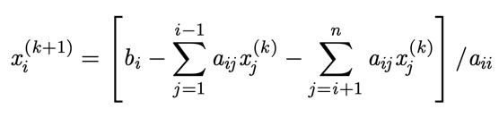

# Jacobi Iteration Solver

## Projektübersicht
Dieses Projekt ist eine C++ Anwendung, die lineare Gleichungssysteme mittels Jacobi-Iteration löst. Es umfasst Funktionen zum Einlesen von Matrix- und Vektordaten aus Dateien, zur Validierung der Daten, zum Lösen des Systems und zum Ausführen verschiedener Tests.

## Jacobi-Iteration Formel
</img>

## Aufbau des Projekts

### Wichtige Dateien und ihre Rollen
- `matrix.hpp`: Definiert die `Matrix` Klasse, die das Einlesen von Matrixdaten aus einer Datei, die Validierung der Daten, das Lösen des Systems mittels Jacobi-Iteration und die Validierung der Lösung übernimmt.
- `importLogik.cpp`: Implementiert den Konstruktor und Methoden der `Matrix` Klasse zum Einlesen und Validieren der Matrixdaten aus einer Datei.
- `verfahrenLogik.cpp`: Implementiert die Methoden zur Überprüfung der Anwendbarkeit der Jacobi-Methode, zum Lösen des Systems und zur Validierung der Lösung.
- `test.hpp`: Definiert die `TestData` und `Test` Klassen zum Verwalten und Ausführen von Tests auf der `Matrix` Klasse.
- `test.cpp`: Implementiert die Methoden der `Test` Klasse zum Ausführen verschiedener Tests auf der `Matrix` Klasse.
- `main.cpp`: Enthält die `main` Funktion, die entweder den Solver auf einer gegebenen Datei ausführt oder alle Tests ausführt.
- `testData/`: Enthält Testdaten für die `Matrix` Klasse. Automatisch generiert
- `example/`: Beispiel Datei für die Eingabe von Matrixdaten - Musterbeispiel
- `test.txt`: Ausführliche Erläuterung der Tests und der Testdaten
-  `img.png`: Bild der Jacobi-Iteration Formel
- `solver`: Ausführbare Datei
-  `COMPILE.txt`: Befehl zum Kompilieren des Projekts

## Kompilierung
Das Projekt wird mit folgendem Befehl kompiliert:
```sh
clang++ main.cpp importLogik.cpp verfahrenLogik.cpp test.cpp -o solver -std=c++20 -Wall -Wextra -Wpedantic
```
## Verwendung
Das Programm kann auf zwei Arten verwendet werden:
1. Lösen eines linearen Gleichungssystems aus einer Datei:
```sh
./solver <Pfad zur Datei>
```
2. Ausführen aller Tests:
```sh
./solver test
```